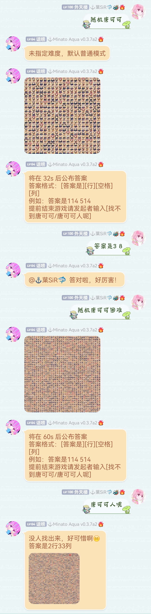

<div align="center">
    </br>

# Random Tan Kuku

<!-- prettier-ignore-start -->
<!-- markdownlint-disable-next-line MD036 -->
_🎶 随机唐可可 🎶_
<!-- prettier-ignore-end -->

</div>
<p align="center">
  
  <a href="https://github.com/MinatoAquaCrews/nonebot_plugin_randomtkk/blob/main/LICENSE">
    
  </a>

  <a href="https://github.com/nonebot/nonebot2">
    
  </a>

  <a href="https://github.com/MinatoAquaCrews/nonebot_plugin_randomtkk/releases/tag/v0.1.3rc1">
    
  </a>

  <a href="https://www.codefactor.io/repository/github/MinatoAquaCrews/nonebot_plugin_randomtkk">
    
  </a>
  
</p>

## 版本

v0.1.3rc1

⚠ 适配nonebot2-2.0.0beta.2+

[更新日志](https://github.com/MinatoAquaCrews/nonebot_plugin_randomtkk/releases/tag/v0.1.3rc1)

## 安装

1. 通过`pip`或`nb`安装；

2. 随机唐可可图片等资源位于`./resource`下，可在`env`下设置`TKK_PATH`更改；

    ```python
    TKK_PATH="your_path_to_resource"
    ```

3. 可更改默认配置：

    ```python
    TKK_PATH="./data/resource"  # 资源路径
    EASY_SIZE=10                # 简单
    NORMAL_SIZE=20              # 普通
    HARD_SIZE=40                # 困难
    EXTREME_SIZE=60             # 地狱
    MAX_SIZE=80                 # 自定义的最大尺寸，建议不要大于99
    SHOW_COORDINATE=true        # 是否显示坐标文字，建议开启
    ```

    注意图片最小尺寸为10，最大尺寸可通过`MAX_SIZE`修改（默认80，不要超过99，否则无法指定），但生成时间会变长；`SHOW_COORDINATE`开启会在生成的图片方阵中显示坐标。
    
4. 缺失资源时会尝试从repo中下载至指定路径。

    ⚠ 使用`raw.fastgit.org`进行加速，不确保下载成功

5. 呜↗太⬆好⬇听↙了↖吧↗你唱歌真的好好听啊，简直就是天籁！我刚才，听到你唱歌了。我们以后一起唱好不好？一起唱！一起做学园偶像！

## 功能

寻找LoveLive角色！（主要是唐可可）

## 命令

1. 开始游戏：[随机唐可可][空格][简单/普通/困难/地狱/自定义数量]，开始游戏后会限时挑战，可替换为其他角色名；

    ⚠ 仅能以[随机唐可可]不指定难度（默认普通）的方式开启游戏，若想寻找其他角色请使用完整命令

    ⚠ 角色名包括组合「[LoveLive!-μ's](https://zh.moegirl.org.cn/LoveLive!)」、「[LoveLive!Sunshine!!-Aqours](https://zh.moegirl.org.cn/LoveLive!Sunshine!!)」、「[LoveLive!Superstar!!-Liella](https://zh.moegirl.org.cn/LoveLive!Superstar!!)」成员名称及常见昵称

2. 显示帮助：[随机唐可可][空格][帮助]，可替换为其他角色名，效果一样；

3. 输入答案：[答案是][行][空格][列]，行列为具体数字，例如：答案是114 514；

4. 答案正确则结束此次游戏；不正确则直至倒计时结束，Bot公布答案并结束游戏；

5. 提前结束游戏：[找不到唐可可]（或其他角色名），仅**游戏发起者**可提前结束游戏；

6. 各群聊互不影响，每个群聊仅能同时开启一局游戏。

## 功能展示



## 本插件改自

[Hoshino-randomtkk](https://github.com/kosakarin/hoshino_big_cockroach)
